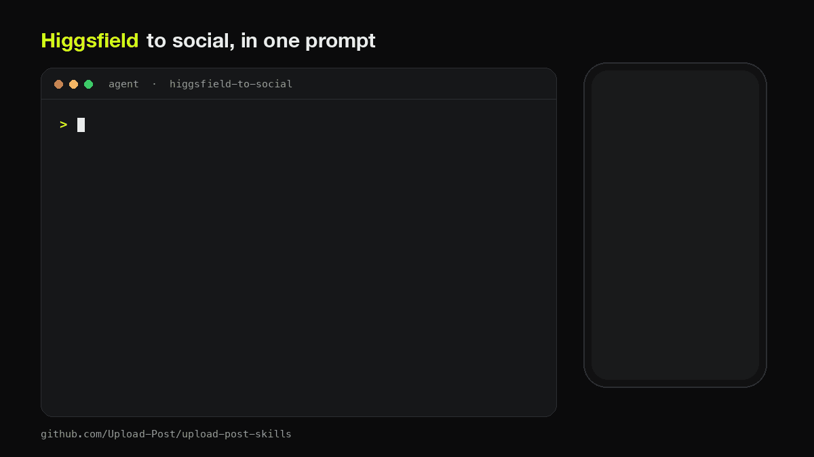

<div align="center">

# Higgsfield to Social

**Generate with [Higgsfield](https://higgsfield.ai). Post everywhere with [Upload-Post](https://upload-post.com). One prompt.**



<sub>Illustration of the flow</sub>

</div>

---

```
Make a 9:16 Seedance clip of a coffee cup in morning light, score the hook,
and post it to TikTok, Reels and Shorts tomorrow at 9am.
```

| Step | What happens |
|---|---|
| 1. Destination | The agent reads your connected accounts and picks the format: 9:16 for TikTok, Reels and Shorts, 4:5 for the Instagram feed, 16:9 for YouTube, X and LinkedIn |
| 2. Generate | `higgsfield generate create` with Seedance, Kling, Veo, Nano Banana, GPT Image, Soul or a Marketing Studio ad, cost quoted first |
| 3. Score | Optional Virality Predictor run on videos. A weak hook gets an offer to re-roll the opening and compare both versions, capped at two rounds |
| 4. Approve | You see the clip, one caption per platform (sized to each limit, editable one by one) and the schedule. Nothing goes out without your yes |
| 5. Publish | The CDN URL goes straight to Upload-Post, which posts or schedules it with the AI-generated label and returns the link of every post |

Nothing is downloaded to your machine, and one prompt can land on 13 platforms: TikTok,
Instagram, YouTube, LinkedIn, Facebook, X, Threads, Pinterest, Bluesky, Telegram, Discord,
Mastodon and Google Business Profile.

## Requirements

- [Higgsfield CLI](https://github.com/higgsfield-ai/cli), logged in (`higgsfield auth login`)
- An [Upload-Post](https://upload-post.com) account with your social accounts connected, used
  through the MCP connector (`https://mcp.upload-post.com/mcp`) or an API key in
  `UPLOAD_POST_API_KEY`

## Install

```bash
npx skills add Upload-Post/upload-post-skills
```

Or copy `skills/higgsfield-to-social/` into your agent's skills directory. Works in Claude Code,
Codex, Cursor, Gemini CLI, OpenClaw and any agent that loads Agent Skills.

## Try it

```
Generate three 4:5 product shots of my sneakers with GPT Image and post them
as an Instagram carousel.
```

```
Turn this headshot into a UGC ad with Marketing Studio, score it, and schedule
it on TikTok and Reels for Friday 6pm.
```
